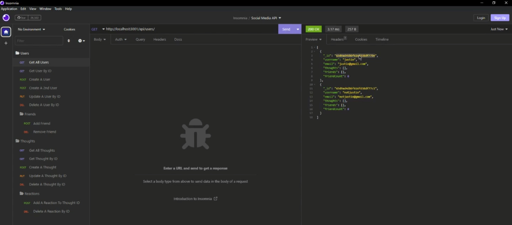

# **Social Network API**


## **Description**

This project is a social media network API that currently can create users, add friends, remove friends create "thoughts" (like posts), and reactions (like comments) and remove thoughts and reactions. This is purely back-end and can be used by anyone that wants a decent starter for a social network project.

This project uses primarily MongoDB and Mongoose along with a lot of javascript.

As a bonus, when deleting friends it will also delete all of their thoughts. As an extra bonus, when adding friends it now adds both ways. It also removes both ways when either friend removes the other. Also when deleting the user, everyone who's friends with the user will have them removed from their list. 

Video link to the app in action: https://watch.screencastify.com/v/QZdUMMYRsMcbZxMoGE8p

---

## **Table of Contents**

* [Installation](#installation)

* [Video](#video)

* [Usage](#usage)

* [License](#license)

* [Contributing](#contributing)

* [Questions](#questions)

---

## **Installation**

To install the needed dependencies, run the following commands:

```
npm i
```

Once everything is installed you just need to run: 

```
npm start
```

From there you can access the API with Insomnia at http://localhost:3001/api/users or http://localhost:3001/api/thoughts. 

---

## **Video**



Watch a video going over the functionality of the app here: https://watch.screencastify.com/v/QZdUMMYRsMcbZxMoGE8p

---

## **Usage**

This can be used as the back-end for a simple social media app. This is licensed with MIT so it's free to use for anyone. It can be modified to fit your needs or if you want to expirement with it feel free. If you'd like to add any features to this release, just submit them as issues on the repo.

---

## **License**

This project is licensed under the MIT license.

---

## **Contributing**

You can contribute to this project by either opening issues on the github repo or by emailing me directly at my contact info below.

---

## **Questions**

If you have any questions about the project or repo, contact me directly at justincodingclass@gmail.com or open an issue on the repo. You can find my github profile with this project and others at [github.com/jwatkins28](https://github.com/jwatkins28/)
